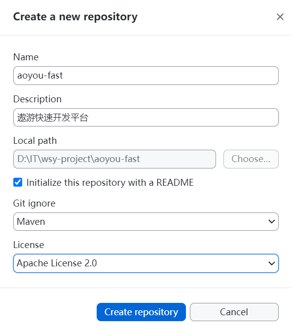

# 第01章_项目介绍及搭建

## 1. 前后端分离

前后端分离主要目的是**解耦**，核心思想是：前端Html页面通过Ajax调用后端的 RestFul API 并使用Json数据进行数据交互。

- 前端项目部署到**Web服务器**上：Web服务器一般只能解析静态资源如html、css、图片、文档等，一般性能较强，常用的有Nginx
- 后端项目部署到**应用服务器**上：应用服务器可以解析动态资源和静态资源，解析静态资源的性能没有Web服务器好，常用的有Tomcat

一般来说Web服务器暴露在公网上，而应用服务器只允许内网访问，前端向后端发送的http请求会通过Web服务器代理到对应的后端服务接口上。

## 2. 搭建后端项目

### 2.1 创建父工程

创建一个新的Maven项目作为父工程，然后删除src目录。父工程只用于管理依赖版本，在pom文件中添加：

```xml
<groupId>com.thuwsy.aoyou</groupId>
<artifactId>aoyou-fast</artifactId>
<version>${aoyou.version}</version>
<description>父工程，用于管理依赖版本</description>

<properties>
    <maven.compiler.source>17</maven.compiler.source>
    <maven.compiler.target>17</maven.compiler.target>
    <project.build.sourceEncoding>UTF-8</project.build.sourceEncoding>
    <aoyou.version>1.0.0</aoyou.version>
    <springboot.version>3.1.5</springboot.version>
    <druid.version>1.2.20</druid.version>
    <fastjson2.version>2.0.39</fastjson2.version>
    <springdoc.version>2.1.0</springdoc.version>
    <mybatis-plus.version>3.5.3.2</mybatis-plus.version>
    <jwt.version>4.4.0</jwt.version>
    <hutool.version>5.8.22</hutool.version>
</properties>

<dependencyManagement>
    <dependencies>
        <dependency>
            <groupId>org.springframework.boot</groupId>
            <artifactId>spring-boot-dependencies</artifactId>
            <version>${springboot.version}</version>
            <type>pom</type>
            <scope>import</scope>
        </dependency>
        <dependency>
            <groupId>com.alibaba</groupId>
            <artifactId>druid-spring-boot-starter</artifactId>
            <version>${druid.version}</version>
        </dependency>
        <dependency>
            <groupId>com.alibaba.fastjson2</groupId>
            <artifactId>fastjson2</artifactId>
            <version>${fastjson2.version}</version>
        </dependency>
        <dependency>
            <groupId>org.springdoc</groupId>
            <artifactId>springdoc-openapi-starter-webmvc-ui</artifactId>
            <version>${springdoc.version}</version>
        </dependency>
        <dependency>
            <groupId>com.baomidou</groupId>
            <artifactId>mybatis-plus-boot-starter</artifactId>
            <version>${mybatis-plus.version}</version>
        </dependency>
        <dependency>
            <groupId>com.baomidou</groupId>
            <artifactId>mybatis-plus-generator</artifactId>
            <version>${mybatis-plus.version}</version>
        </dependency>
        <dependency>
            <groupId>com.auth0</groupId>
            <artifactId>java-jwt</artifactId>
            <version>${jwt.version}</version>
        </dependency>
        <dependency>
            <groupId>cn.hutool</groupId>
            <artifactId>hutool-all</artifactId>
            <version>${hutool.version}</version>
        </dependency>
    </dependencies>
</dependencyManagement>
```

### 2.2 创建子模块

- `aoyou-common`：定义使用的公共模块，工具类等
- `aoyou-support`：定义项目中的核心支持，如Spring Security、Redis等
- `aoyou-starter`：定义项目的入口
- 业务模块：`aoyou-auth`（用户认证）、

注意：在`aoyou-starter`模块中需要引入web依赖，并且创建主启动类

```xml
<dependency>
    <groupId>org.springframework.boot</groupId>
    <artifactId>spring-boot-starter-web</artifactId>
</dependency>
```

```java
// 包名为com.thuwsy.aoyou
@SpringBootApplication
public class AoyouApplication {
    public static void main(String[] args) {
        SpringApplication.run(AoyouApplication.class, args);
    }
}
```

## 3. 搭建前端项目

```powershell
# 1.创建命令
npm create vue@latest

# 2.具体配置
## 配置项目名称
Project name: aoyou-admin-ui
## 是否添加TypeScript支持
Add TypeScript?  Yes
## 是否添加JSX支持
Add JSX Support?  No
## 是否添加路由环境
Add Vue Router for Single Page Application development?  Yes
## 是否添加pinia环境
Add Pinia for state management?  Yes
## 是否添加单元测试
Add Vitest for Unit Testing?  No
## 是否添加端到端测试方案
Add an End-to-End Testing Solution? » No
## 是否添加ESLint语法检查
Add ESLint for code quality?  No
## 是否添加Prettiert代码格式化
Add Prettier for code formatting?  No
```

```powershell
# 安装依赖
npm install
# 启动项目
npm run dev
# 构建项目
npm run build
```

## 4. 上传git仓库



修改`.gitignore`，来忽略一些文件：

```
HELP.md
target/
!.mvn/wrapper/maven-wrapper.jar
!**/src/main/**/target/
!**/src/test/**/target/

### STS ###
.apt_generated
.classpath
.factorypath
.project
.settings
.springBeans
.sts4-cache

### IntelliJ IDEA ###
.idea
*.iws
*.iml
*.ipr
**/mvnw
**/mvnw.cmd
**/.mvn
**/target/
**/.gitignore

### NetBeans ###
/nbproject/private/
/nbbuild/
/dist/
/nbdist/
/.nb-gradle/
build/
!**/src/main/**/build/
!**/src/test/**/build/
logs/

### VS Code ###
.vscode/
package-lock.json

```

